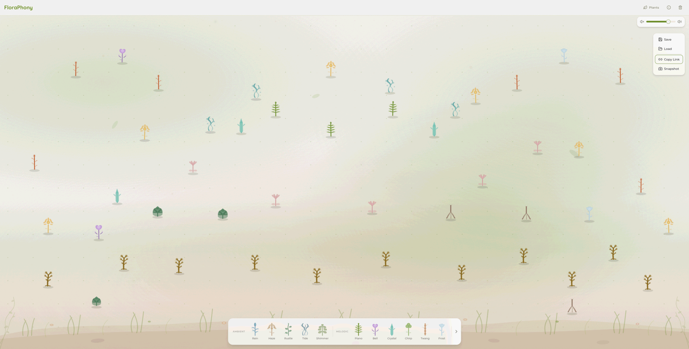

# FloraPhony

**소리가 피어나는 정원을 가꿔보세요.**

씨앗 대신 소리를 심는 로파이 앰비언트 뮤직 가든.

[바로 시작하기](https://flora-phony.vercel.app) · [English](./README.md)



[내 정원 미리듣기](https://flora-phony.vercel.app/?g=BBJKBAdPBBpLBCVKBC5OBDhJBENNBExIBFNPBFlHBF5QEQc_ERUjETAQEUUYEVQoEWE_DRE2DSMhDT8iASgcATAiATkcAxIMAw5BEFIMEFU7Ag5VAhc6AiA7EkE7Ekw7ElNXEx8hEyUXEzkVE0IcCxwtCyg3CzY5C0YxC04nDBcUDAsQDAUsDEsUDFoSDF0z)

---

## FloraPhony란?

FloraPhony는 브라우저에서 바로 즐기는 인터랙티브 뮤직 가든입니다. 캔버스 위에 음악 식물을 드래그 앤 드롭하면 나만의 로파이 앰비언트 사운드스케이프가 만들어집니다. 각 식물은 고유한 합성 사운드를 가지고 있으며, 함께 어우러져 살아 숨쉬는 음악 정원이 됩니다.

회원가입도, 다운로드도 필요 없습니다. 열고, 심고, 듣기만 하면 됩니다.

## 주요 기능

- **20종의 사운드 식물** — Ambient, Melodic, Rhythmic, Pads 4개 카테고리에서 선택. 각 식물마다 고유한 합성 사운드를 가지고 있습니다.
- **드래그 앤 드롭 작곡** — 캔버스 어디든 식물을 배치하세요. 정원을 꾸미는 것 자체가 작곡입니다.
- **실시간 오디오 합성** — Tone.js로 모든 사운드를 실시간 생성합니다. 루프도 샘플도 없이, 매 순간이 유니크합니다.
- **URL 공유** — 정원 전체가 URL에 담깁니다. 링크를 복사해서 누구에게든 공유하면, 당신이 만든 그대로를 들을 수 있습니다.
- **저장 & 불러오기** — 정원 스냅샷을 저장하고 언제든 다시 불러올 수 있습니다.
- **제로 프릭션** — 계정도, 설치도 필요 없습니다. 모던 브라우저만 있으면 됩니다.

## 사운드 식물

| 카테고리 | 식물 |
|----------|------|
| **Ambient** | Rain Reed, Haze Lily, Rustle Ivy, Tide Seaweed, Shimmer Sage |
| **Melodic** | Lofi Fern, Bell Flower, Crystal Cactus, Chirp Clover, Twang Bamboo, Frost Orchid |
| **Rhythmic** | Pulse Moss, Wind Wood, Groove Root, Spark Daisy, Bubble Kelp |
| **Pads** | Echo Vine, Drift Willow, Hum Lotus, Ember Thorn |

## 기술 스택

Next.js 16 · React 19 · Konva.js · Tone.js · Zustand · Tailwind CSS

## 로컬 실행

```bash
npm install
npm run dev
```

[http://localhost:3000](http://localhost:3000)에서 확인하세요.

## 라이선스

- 소스 코드는 [MIT 라이선스](./LICENSE)를 따릅니다.
- 시각 에셋(`public/plants/`), 사운드 디자인 파라미터(`src/lib/audio/synth-placeholders.ts`), 식물 정의(`src/data/plant-registry.ts`)는 [CC BY-NC-SA 4.0](./LICENSE-ASSETS)을 따릅니다.
